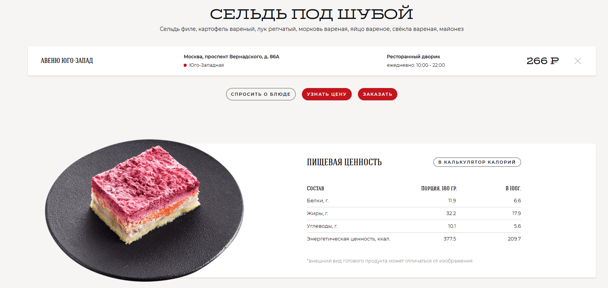

# Описание задачи

Проект предназначен для автоматического сбора информации о продуктах из меню сети ресторанов "Теремок". Парсер извлекает детальную информацию о каждом блюде, включая ***название***, ***состав***, ***пищевую ценность (за 100 грамм)*** и ***цену блюда*** в ресторане "Звездочка", метро Юго-Западная. В случае, если какое-то блюдо отсутствует в "Звездочке", выбирается случайный ресторан.
Пример карточки товара представлен на Рисунке 1.

  
   
  <strong>Рисунок 1 - Пример карточки товара</strong>

